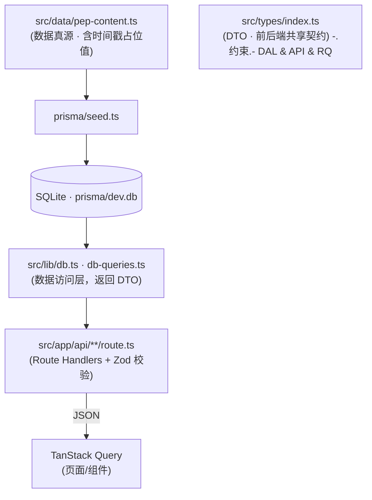
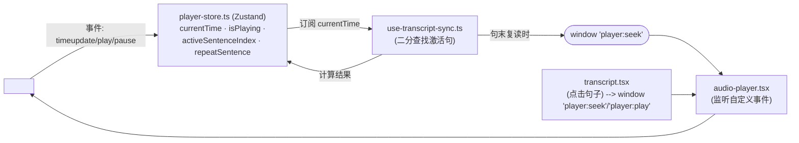

# CLAUDE.md

This file provides guidance to Claude Code (claude.ai/code) when working with code in this repository.

## 项目概述

人教 PEP（三起）小学英语听力同步学习 Web 应用。核心体验：播放音频时课文逐句高亮同步（卡拉 OK 式跟读），配合单句复读、进度跟踪与课后练习。功能介绍与完整目录结构见 `README.md`，本文件只补充读代码才能掌握的架构与约定。

技术栈：Next.js 14（App Router，全栈）+ React 18 + TypeScript + Tailwind + Zustand（播放器状态）+ TanStack Query（数据获取）+ Prisma/SQLite + Zod（校验）+ Vitest/Playwright。

## 常用命令

```bash
npm run dev            # 开发服务器 (http://localhost:3000)
npm run build && npm run start   # 生产构建与启动
npm run lint           # ESLint (eslint-config-next)

# 数据库 (Prisma)
npm run db:generate    # 生成 @prisma/client 类型
npm run db:push        # 把 schema 同步到 SQLite (prisma/dev.db)，无迁移文件
npm run db:seed        # 用 src/data/pep-content.ts 的数据播种
npm run db:reset       # 清库并重新播种（会删数据，谨慎）
npm run db:studio      # Prisma Studio 可视化

# 测试
npm run test           # vitest watch
npm run test:run       # vitest 单次运行
npm run test:run -- src/lib/utils.test.ts        # 运行单个测试文件
npx vitest run -t "二分查找"                       # 按测试名运行单个用例
npm run test:e2e       # Playwright（端到端）

# 音频/时间戳工具（见下文「音频与时间戳」一节）
node scripts/generate-audio.mjs     # 生成 TTS 音频并回写真实时间戳
node scripts/verify-timestamps.mjs  # 打印某课文句子时间戳核对
```

首次运行：`npm install` → `db:generate` → `db:push` → `db:seed` → `dev`。`prisma/dev.db` 已入库，可直接 `npm run dev` 看到数据。

路径别名 `@/*` → `./src/*`（tsconfig 与 vitest 均已配置）。

## 架构

### 数据流与数据真源

数据沿一条单向链路流转，越靠近链路末端越接近展示层：



关键点：
- **`src/data/pep-content.ts` 是业务数据真源**。新增/修改课文、句子、练习都在这里改，再 `db:seed`。其中句子的 `startTime/endTime` 与课文 `duration` 是**占位值**，真实值由 `generate-audio.mjs` 回写（见下文）。
- **数据访问层只返回 DTO**（`src/types/index.ts`）。`db.ts` 负责 Prisma 行 → DTO 映射，包括把 `Exercise` 的 `options`/`answer` 从 JSON 字符串解析成结构化对象（`parseExerciseOptions`）。改字段时 DTO、DAL、`pep-content.ts` 三处要同步。
- **API 层统一 `try/catch` + Zod `safeParse` + 中文错误信息**，错误用 `console.error("[API] ...")` 记录。GET 走 query 参数，写操作走 JSON body。

### 播放器同步架构（应用核心）

这是整个应用最需要理解的子系统。设计采用 **Zustand store 作为单一数据源 + window 自定义事件解耦组件通信**，而非 prop drilling。



- **`use-audio-player.ts` 是 store 的唯一写入者**（源码注释明确强调「单一数据源：所有状态写入由此 Hook 完成」）。`<audio>` 元素的事件把播放状态灌进 store；store 不直接被业务组件改写。
- **`use-transcript-sync.ts` 消费 `currentTime`**，用 `src/lib/utils.ts` 中的 `findActiveSentenceIndex`（二分查找，处理句间间隙）算出激活句索引写回 store，并负责自动滚动到视野中央。
- **单句复读通过 `window` 自定义事件回环**：`use-transcript-sync` 检测到时间越过当前句 `endTime` 时 `dispatchEvent(new CustomEvent("player:seek", {detail: startTime}))`；`audio-player.tsx` 监听 `player:seek`/`player:play` 执行跳转/播放。课文点击跳转走的也是这套事件。**新增播放指令时优先复用这两个事件名**，不要新增别的跨组件通信渠道。
- **`use-progress-save.ts` 自动落库**：每 5 秒 / 暂停 / 播放结束（`percentage>=90` 或到末尾）时 POST `/api/progress`。已听时长用「时间点 Set」近似（`completedDurationRef`），保存失败静默重试。

### 学生模型（MVP 单学生）

目前是单一默认学生，无登录。`DEFAULT_STUDENT_ID = "default-student"` 定义在 **`src/lib/utils.ts`**（不在 config）。所有 API route 直接用这个常量，**忽略请求里传入的 studentId**（Zod schema 里虽有 `default("default-student")`，但 route 会用常量覆盖）。涉及学生隔离的改动需要从这里入手。

### 音频与时间戳

- 课文音频放 `public/audio/grade{N}-u{M}-{a|b}.mp3`，`generate-audio.mjs` 用 **espeak-ng（逐句 TTS）+ ffmpeg（拼接、测时长）** 生成，并**回写数据库** `Sentence.startTime/endTime` 与 `Lesson.duration`，使同步高亮与真实播放对齐。
- 改了 `pep-content.ts` 的句子文本后，需重跑 `generate-audio.mjs`（依赖系统装了 `espeak-ng`、`ffmpeg`）再重新播种，否则时间戳与音频错位。
- `scripts/verify-timestamps.mjs` 打印某课文时间戳供核对。

## 约定

- 组件分层：`components/ui/`（shadcn 风格基础件，用 `cn()` 合并 Tailwind 类 + Radix 原语）、`player/`、`exercise/`、`lesson/`、`progress/`、`layout/`。
- 样式用语义化 Tailwind 类（`bg-card` / `text-primary` / `bg-muted` 等，定义见 `tailwind.config.ts` 与 `src/app/globals.css`）；移动端优先，听力页用 `lg:grid-cols-[1fr_380px]` 双栏（左课文右播放器，移动端播放器置顶）。
- TanStack Query 全局 `staleTime: 30s`、`retry: 1`、`refetchOnWindowFocus: false`（见 `components/providers.tsx`）。
- `next.config.mjs` 仅开了 `reactStrictMode`。
