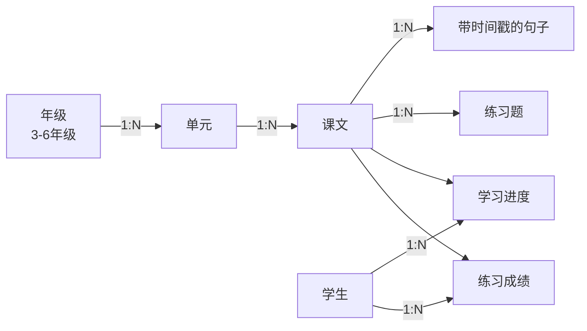

# 英语听力课堂 🎧

> 小学英语课本（人教 PEP 三起）听力同步学习 Web 应用

跟着课文逐句听读，边听边学，轻松提高英语听力。播放时课文逐句高亮同步，支持单句复读、进度跟踪和课后练习。

## ✨ 核心功能

- **🎧 音频播放 + 课文同步高亮**：播放音频时，对应课文句子自动高亮并滚动到视野中央，类似卡拉OK式跟读
- **🔁 单句复读**：开启后自动重复播放当前句子，方便重点句型反复练习
- **⏩ 倍速/跳转**：支持 0.75x / 1x / 1.25x / 1.5x 倍速，可前后跳转 5 秒，点击任意句子跳转播放
- **📊 学习进度跟踪**：自动记录每篇课文的播放位置、完成度，首页展示整体学习统计
- **📝 课后练习测验**：单选、填空、匹配三种题型，即时反馈对错与解析，自动计算成绩

## 🛠️ 技术栈

| 层级 | 技术 |
|------|------|
| 框架 | Next.js 14 (App Router) 全栈 |
| 前端 | React 18 + TypeScript |
| 样式 | Tailwind CSS |
| 状态 | Zustand（播放器全局状态） |
| 数据获取 | TanStack Query |
| 数据库 | SQLite + Prisma ORM |
| 校验 | Zod |
| 测试 | Vitest |

## 📁 项目结构

```
unit-one/
├── prisma/
│   ├── schema.prisma        # 数据模型
│   └── seed.ts              # PEP 示例数据种子
├── public/audio/            # 课文音频文件
├── src/
│   ├── app/
│   │   ├── api/             # 后端 REST API (7 个路由)
│   │   ├── grade/[id]/      # 年级页
│   │   ├── unit/[id]/       # 单元页
│   │   └── lesson/[id]/     # 听力页 + 练习页
│   ├── components/
│   │   ├── player/          # 音频播放器 + 课文同步
│   │   ├── exercise/        # 练习题组件
│   │   ├── lesson/          # 课程相关
│   │   └── ui/              # 基础 UI 组件
│   ├── hooks/               # useAudioPlayer / useTranscriptSync 等
│   ├── lib/                 # prisma / db / utils / 校验
│   ├── stores/              # Zustand 状态
│   └── types/               # 共享类型定义
└── vitest.config.ts
```

## 🚀 快速开始

### 环境要求

- Node.js 18+（推荐 20+）
- npm 9+

### 安装与运行

```bash
# 1. 安装依赖
npm install

# 2. 初始化数据库（首次运行）
npm run db:generate    # 生成 Prisma 客户端
npm run db:push        # 创建 SQLite 表结构
npm run db:seed        # 写入 PEP 示例数据

# 3. 启动开发服务器
npm run dev
```

打开 http://localhost:3000 即可使用。

### 其他命令

```bash
npm run build          # 生产构建
npm run start          # 启动生产服务
npm run lint           # 代码检查
npm run test:run       # 运行单元测试
npm run db:studio      # 可视化查看/编辑数据库
npm run db:reset       # 重置数据库并重新播种
```

## 📖 数据模型



**核心：`Sentence`** 模型包含 `text`(英文)、`translation`(中文)、`startTime`、`endTime`（秒），是"同步高亮"功能的基础。

## 🎵 音频文件

示例数据引用了以下音频文件（需放入 `public/audio/`）：

- `grade3-u1-a.mp3`、`grade3-u1-b.mp3`、`grade3-u2-a.mp3`、`grade4-u1-a.mp3`

MVP 阶段可放入任意短时长的 MP3 用于演示同步效果。真实部署应使用合法的教材配套音频。

> **注意**：数据库中的 `startTime`/`endTime` 需与实际音频时长匹配，才能正确触发同步高亮。

## 🧩 核心实现说明

### 同步高亮原理

1. `useAudioPlayer` Hook 封装 HTML5 Audio，监听 `timeupdate` 事件，将当前播放时间写入 Zustand store
2. `useTranscriptSync` Hook 订阅当前时间，用**二分查找**定位到对应句子，输出激活索引
3. `<Transcript>` 组件根据激活索引高亮对应句子，并 `scrollIntoView` 自动滚动

### 进度自动保存

`useProgressSave` Hook 每 5 秒 / 暂停时 / 播放结束时，通过 POST `/api/progress` 保存进度，完成度 ≥ 90% 标记为已完成。

## 🔮 后续可扩展

- 用户登录与多学生管理
- 录音跟读评分（接入语音识别）
- 教师内容管理后台（上传音频 / 标注时间戳）
- 自动时间戳对齐（ASR / VAD）
- 学习报告导出

## 📜 许可

本项目为教学示例。教材音频版权归 respective 所有者。
